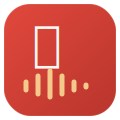

# Thuyết minh logo — 听力练习



Nguồn: [`img/logo.svg`](img/logo.svg). Có 2 logo phái sinh cùng bộ nhận diện:
[`img/logo-windows.svg`](img/logo-windows.svg) và
[`img/logo-linux.svg`](img/logo-linux.svg), dùng trong phần "Tải xuống" của
[index.html](index.html).

## 1. Ý nghĩa

| Thành phần | Ý nghĩa |
|---|---|
| Chữ **听** (nghe) | Trung tâm logo, lấy thẳng từ tên ứng dụng "听力练习" (luyện nghe) — nói ngay được app này làm gì mà không cần giải thích thêm, kể cả với người không biết chữ Hán (hình chữ vẫn đọc được như một ký hiệu/pictogram). |
| Sóng âm (6 vạch, cao thấp so le) | Biểu trưng cho âm thanh đang phát — củng cố thêm ý "nghe" bằng một hình ảnh phổ quát (waveform), không phụ thuộc ngôn ngữ, giống các app nghe nhạc/podcast vẫn dùng. |
| Khối bo góc vuông ("squircle") | Hình dạng chuẩn của icon ứng dụng hiện đại (iOS/Android/macOS đều dùng dạng này) — để logo dùng thẳng làm app icon/favicon/taskbar mà không bị lệch chuẩn thị giác so với icon các app khác trên cùng màn hình. |
| Gradient đỏ → đỏ đậm (`#e2483c` → `#b8352c`) | Đỏ là màu mang tính biểu tượng văn hoá Trung Hoa (may mắn, trang trọng), đồng thời là màu accent chính của toàn bộ app (`frontend/src/index.css`) và trang landing page — logo dùng đúng màu đó để nhất quán, không phải một màu "trang trí" riêng. Gradient (thay vì màu phẳng) tạo chiều sâu nhẹ, tránh trông dẹt. |
| Viền sáng mờ quanh khối | Một đường viền trắng ngà, độ mờ rất thấp (`opacity: 0.12`) — tạo hiệu ứng ánh sáng viền (rim light) nhẹ, giúp icon nổi khối hơn trên cả nền sáng lẫn nền tối, một mẹo phổ biến ở icon app hiện đại. |
| Màu chữ/soundwave `#fff8f3` (trắng ngà, không phải trắng thuần) | Khớp màu nền "paper" của toàn bộ theme app/website, để logo không bị chênh tông khi đặt cạnh các mảng trắng khác của giao diện. |

Hai logo phái sinh (Windows, Linux) dùng **chung khung** (squircle, cùng
gradient, cùng viền sáng) với logo gốc, chỉ đổi phần nội dung bên trong:

- **Windows**: 4 ô vuông bo góc xếp 2×2 (mô-típ lá cờ 4 ô quen thuộc của
  Windows) — vẽ lại bằng màu be của app thay vì 4 màu xanh/đỏ/vàng/xanh lá
  gốc của Microsoft, để nó thuộc về bộ nhận diện của app, không phải logo
  thương hiệu Windows nguyên bản.
- **Linux**: một hình chim cánh cụt cách điệu (gợi nhắc Tux — linh vật quen
  thuộc của Linux) vẽ tối giản bằng đúng 2 tông màu của badge (be trên nền
  đỏ), không sao chép artwork Tux gốc.

Khi chưa có bản Windows (`is-unreleased`), CSS chuyển logo Windows sang
`filter: grayscale(1)` + giảm độ mờ — cùng một hình, chỉ đổi trạng thái thị
giác thành "chưa sẵn sàng", không cần vẽ thêm bản riêng.

## 2. Cách vẽ lại (hoặc chỉnh sửa)

Toàn bộ 3 file đều là SVG thuần (`docs/img/logo*.svg`), có thể mở bằng bất
kỳ trình vector nào (Figma, Illustrator, Inkscape) hoặc sửa tay trực tiếp
vì cấu trúc rất đơn giản. Thông số dựng hình (canvas `viewBox="0 0 120
120"`):

1. **Khối nền (squircle)**: hình chữ nhật bo góc
   `x=4 y=4 width=112 height=112 rx=26`, tô bằng
   `linearGradient` 2 điểm dừng — `#e2483c` (góc trên-trái) → `#b8352c`
   (góc dưới-phải).
2. **Viền sáng**: vẽ đè cùng một hình chữ nhật đó, `fill="none"`,
   `stroke="#fff8f3"` với `stroke-opacity="0.12"`, `stroke-width="1.5"`.
3. **Chữ 听**: `<text>` căn giữa theo chiều ngang tại `x≈47` (lệch trái nhẹ
   so với tâm 60, để cân thị giác với phần soundwave bên dưới), `y≈60`,
   `font-size≈48`, `font-weight="700"`, font ưu tiên chữ Hán
   (`'Noto Sans SC', 'PingFang SC', sans-serif`), màu `#fff8f3`.
4. **Soundwave**: 6 đoạn thẳng đứng (`<line>`), `stroke-width="5"`,
   `stroke-linecap="round"`, cách đều nhau ~12px theo trục x, chiều cao
   tăng dần rồi giảm dần (thấp → cao → cao nhất → cao → thấp → một chấm) để
   trông giống một cụm sóng âm thực tế, màu `#f4c98b`.
   > Lưu ý kỹ thuật: **không** tô các `<line>` này bằng `linearGradient` —
   > một đoạn thẳng đứng có bounding box rộng = 0, nên gradient theo
   > `objectBoundingBox` (mặc định của SVG) sẽ bị coi là suy biến và render
   > ra trong suốt ở một số trình duyệt/renderer (gặp lỗi này khi vẽ bản
   > đầu, xem lịch sử file). Dùng màu phẳng cho các nét mảnh như thế này.
5. **Hai logo phái sinh**: lặp lại bước 1–2 y hệt (đổi id gradient để
   tránh trùng khi nhúng nhiều SVG trên cùng một trang), rồi:
   - Windows: 4 `<rect>` bo góc nhẹ (`rx=3`), kích thước `28×28`, xếp 2×2
     cách nhau ~10px ở chính giữa khối, tô `#fff8f3`.
   - Linux: một `<ellipse>` làm đầu, một `<path>` hình giọt nước lộn ngược
     làm thân, 2 `<ellipse>` nhỏ + 1 `<path>` tam giác làm mắt/mỏ (màu
     `#b8352c`, tương phản với thân), và 2 `<path>` nhỏ làm chân — tất cả
     vẽ tự do bằng mắt cho tới khi trông giống chim cánh cụt, không có
     công thức toạ độ chính xác (khác với 2 logo còn lại là hình học đều).

Muốn chỉnh nhanh (đổi màu, đổi chữ, đổi tỷ lệ soundwave...), sửa thẳng số
trong 3 file SVG rồi mở lại bằng trình duyệt hoặc render thử:

```bash
# xem nhanh trong trình duyệt
xdg-open docs/img/logo.svg

# hoặc render ra PNG để kiểm tra ở nhiều kích thước
rsvg-convert -w 512 -h 512 docs/img/logo.svg -o /tmp/logo-512.png
```

## 3. Logo được dùng ở đâu trong dự án

- **Icon ứng dụng Electron** — `electron/build/icon.png` (render 512×512 từ
  `docs/img/logo.svg`), khai báo ở `electron/package.json`
  (`build.icon`). Đây là icon hiển thị ở AppImage/desktop entry/rpm, thay
  cho icon mặc định của electron-builder trước đây.
- **Favicon của app (React/Vite)** — `frontend/public/favicon.svg`, cùng
  file với `docs/img/logo.svg`.
- **Favicon của trang landing page** — `docs/index.html`'s `<link
  rel="icon">` trỏ thẳng tới `img/logo.svg`.
- **Phần "Tải xuống"** — `img/logo-linux.svg` và `img/logo-windows.svg`
  trong 2 thẻ hệ điều hành.

Nếu vẽ lại logo gốc (`logo.svg`), nhớ chạy lại lệnh render PNG ở trên để
cập nhật `electron/build/icon.png` — file đó không tự đồng bộ với SVG.
