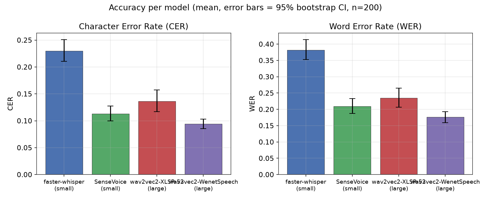
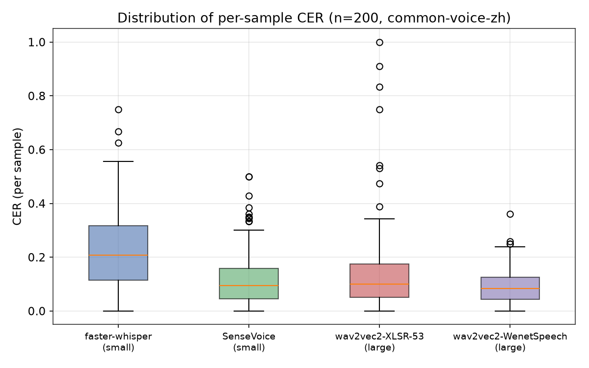
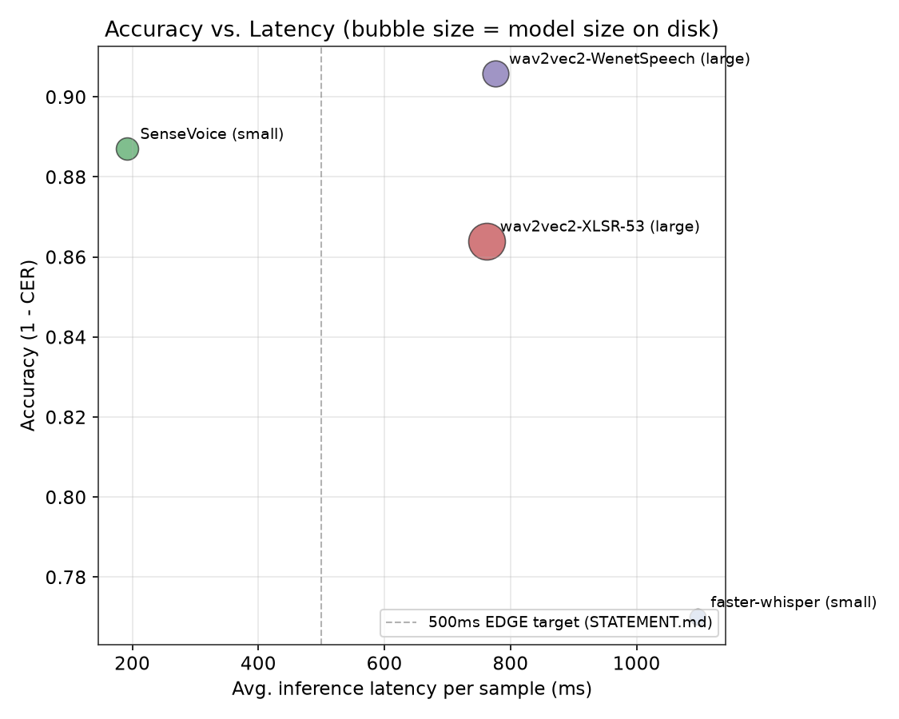
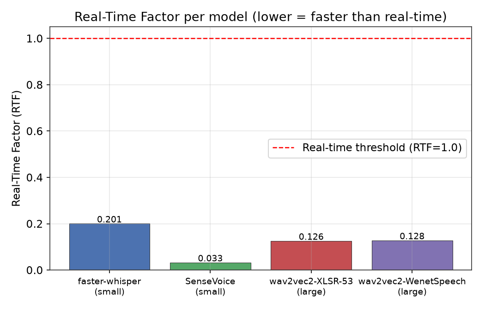
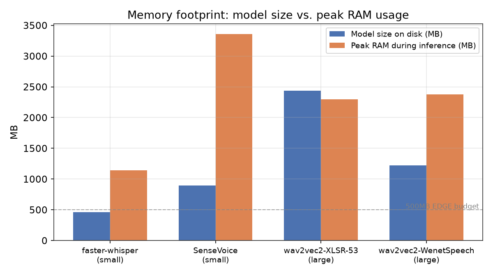
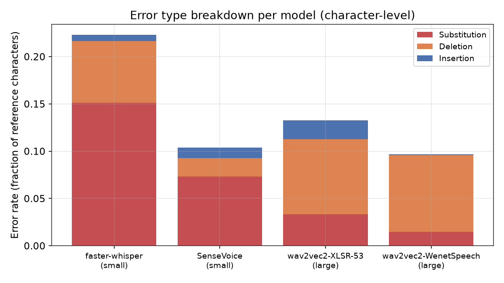
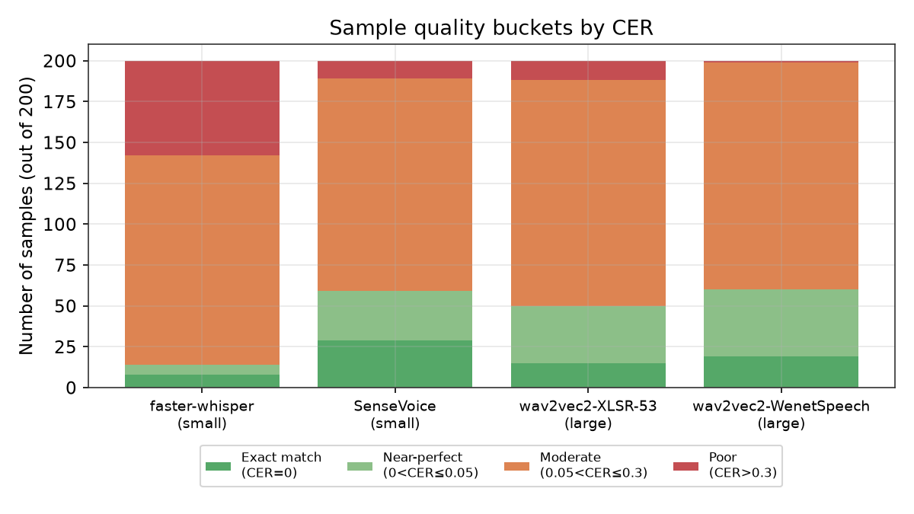

# Báo cáo Benchmark: So sánh 4 mô hình Speech-to-Text tiếng Trung trên bộ common-voice-zh

> **Bản trình bày dạng slide (PDF, 10 trang, có phân tích lỗi):** [`report.pdf`](report.pdf) — nguồn: [`slides.html`](slides.html). Tài liệu này (`main.md`) là bản chi tiết đầy đủ hơn, dùng làm nguồn tham chiếu.

**Ngày:** 2026-07-22
**Bộ dữ liệu:** `experiments/tts_models/data/common-voice-zh` (200 samples)
**Bối cảnh đầy đủ:** xem [`../STATEMENT.md`](../STATEMENT.md)
**Dữ liệu thô:** [`../../benchmarks/results.json`](../../benchmarks/results.json), [`../../benchmarks/results_summary.csv`](../../benchmarks/results_summary.csv)
**Số liệu thống kê thô:** [`stats.json`](stats.json)

## 1. Mục tiêu

Xác định mô hình STT tiếng Trung phù hợp nhất để triển khai trên EDGE devices (CPU-only, không cloud) cho ứng dụng Chinese Dictation, theo tiêu chí đã đặt ra trong STATEMENT.md: accuracy (WER/CER/tone), latency (RTF < 1.0), và resource footprint (model size, RAM).

Báo cáo này trình bày kết quả benchmark đầu tiên trên bộ `common-voice-zh` (200 samples, crowd-sourced read-speech), có kèm kiểm định thống kê để xác nhận độ tin cậy của kết luận, không chỉ dừng ở so sánh số trung bình.

## 2. Phương pháp

### 2.1. Mô hình được test

| Model | Checkpoint | Kiến trúc | Model size |
|---|---|---|---|
| faster-whisper-small | `Systran/faster-whisper-small` | Whisper (CTranslate2, int8) | 464 MB |
| SenseVoice-small | `iic/SenseVoiceSmall` | SenseVoice (FunASR) | 896 MB |
| wav2vec2-XLSR-53 | `jonatasgrosman/wav2vec2-large-xlsr-53-chinese-zh-cn` | Wav2Vec2-CTC (multilingual pretrain) | 2434 MB |
| wav2vec2-WenetSpeech | `wbbbbb/wav2vec2-large-chinese-zh-cn` | Wav2Vec2-CTC (WenetSpeech pretrain) | 1224 MB |

*Lưu ý:* checkpoint thứ 4 ban đầu dự kiến là `TencentGameMate/chinese-wav2vec2-base` nhưng checkpoint đó không có CTC head/vocab (chỉ là backbone pretrained, không transcribe trực tiếp được), nên đã đổi sang `wbbbbb/wav2vec2-large-chinese-zh-cn` — cùng kiến trúc wav2vec2-large với model #3 nhưng khác nguồn training data (WenetSpeech thay vì XLSR-53 multilingual + CommonVoice fine-tune).

### 2.2. Metrics

- **CER** (Character Error Rate): metric chính cho tiếng Trung, tính bằng `jiwer` ở cấp ký tự.
- **WER** (Word Error Rate): tính sau khi segment từ bằng `jieba`.
- **Tone accuracy**: so khớp tone sequence (pypinyin, TONE3), best-effort — chỉ tính khi độ dài pinyin dự đoán khớp với ground truth, ngược lại bỏ qua.
- **Latency/RTF**: đo trực tiếp qua `time.perf_counter()` quanh lệnh inference, RTF = latency / audio_duration.
- **Model size / Peak RAM**: model size = dung lượng thực trên đĩa (dedupe theo inode do cache HF/ModelScope dùng symlink); peak RAM = `resource.getrusage().ru_maxrss` toàn tiến trình (mỗi model chạy trong 1 subprocess riêng để tránh nhiễu chéo).

### 2.3. Chuẩn hóa quan trọng

Trong lúc chạy pipeline, phát hiện **faster-whisper trả về chữ Phồn thể (Traditional)** dù ground truth là Giản thể (zh-CN) — nếu không xử lý sẽ làm CER của Whisper bị thổi phồng sai lệch do khác biệt chữ viết chứ không phải lỗi nhận dạng thật. Đã áp dụng chuẩn hóa Traditional→Simplified (`opencc`, t2s) cho **tất cả** model trước khi tính CER/WER/tone accuracy, đảm bảo so sánh công bằng.

### 2.4. Kiểm định thống kê

Với 200 samples được chạy trên **cùng một test set** cho cả 4 model (paired data), áp dụng:

1. **Friedman test** (non-parametric repeated-measures ANOVA) trên CER per-sample của 4 model — kiểm tra có tồn tại khác biệt tổng thể giữa các model hay không.
2. **Wilcoxon signed-rank test** (post-hoc, paired) cho từng cặp trong 6 cặp model, hiệu chỉnh **Bonferroni** (α = 0.05/6 ≈ 0.0083) để tránh false positive do multiple comparisons.
3. **Bootstrap 95% CI** (5000 resamples) cho CER/WER/latency trung bình của từng model, nhằm định lượng độ chính xác (precision) của ước lượng trên 200 samples — trả lời câu hỏi "200 samples có đủ tin cậy không".

## 3. Kết quả

### 3.1. Bảng tổng hợp

| Model | WER | CER | Tone Acc | Latency (avg) | RTF | Model Size | Peak RAM |
|---|---|---|---|---|---|---|---|
| SenseVoice-small | 0.209 | **0.113** | 0.985 | **191 ms** | **0.033** | 896 MB | 3356 MB |
| wav2vec2-WenetSpeech | **0.176** | **0.094** | **0.996** | 776 ms | 0.128 | 1224 MB | 2375 MB |
| wav2vec2-XLSR-53 | 0.235 | 0.136 | 0.995 | 762 ms | 0.126 | 2434 MB | 2298 MB |
| faster-whisper-small | 0.382 | 0.230 | 0.958 | 1096 ms | 0.201 | **464 MB** | 1139 MB |

*(In đậm = tốt nhất theo cột đó)*

### 3.2. CER/WER với khoảng tin cậy 95% (bootstrap)



| Model | CER (95% CI) | WER (95% CI) |
|---|---|---|
| SenseVoice-small | 0.113 [0.100, 0.127] | 0.209 [0.188, 0.233] |
| wav2vec2-WenetSpeech | 0.094 [0.085, 0.103] | 0.176 [0.159, 0.193] |
| wav2vec2-XLSR-53 | 0.136 [0.117, 0.157] | 0.235 [0.207, 0.265] |
| faster-whisper-small | 0.230 [0.211, 0.251] | 0.382 [0.352, 0.413] |

Khoảng tin cậy khá hẹp (~2 điểm phần trăm) cho cả 4 model — với n=200, ước lượng CER/WER trung bình đủ ổn định để so sánh sơ bộ giữa các model có chênh lệch lớn (vd. faster-whisper so với 3 model còn lại).

### 3.3. Phân phối CER theo từng sample



faster-whisper không chỉ có CER trung bình cao hơn mà còn phương sai lớn hơn hẳn (nhiều outlier CER > 0.6), cho thấy độ ổn định (consistency) kém hơn 3 model còn lại trên bộ dữ liệu này.

### 3.4. Kiểm định ý nghĩa thống kê (statistical significance)

**Friedman test** (khác biệt tổng thể giữa 4 model, đo trên CER per-sample):

> χ² = 233.66, p < 0.000001 → **có khác biệt có ý nghĩa thống kê** giữa ít nhất 1 cặp model.

**Wilcoxon signed-rank post-hoc** (Bonferroni α ≈ 0.0083):

| Cặp so sánh | p-value | Kết luận |
|---|---|---|
| faster-whisper vs SenseVoice | < 0.000001 | **Khác biệt có ý nghĩa** (SenseVoice tốt hơn) |
| faster-whisper vs wav2vec2-XLSR-53 | < 0.000001 | **Khác biệt có ý nghĩa** (XLSR-53 tốt hơn) |
| faster-whisper vs wav2vec2-WenetSpeech | < 0.000001 | **Khác biệt có ý nghĩa** (WenetSpeech tốt hơn) |
| wav2vec2-XLSR-53 vs wav2vec2-WenetSpeech | < 0.000001 | **Khác biệt có ý nghĩa** (WenetSpeech tốt hơn) |
| SenseVoice vs wav2vec2-XLSR-53 | 0.0473 | Không đủ ý nghĩa sau hiệu chỉnh (α=0.0083) |
| SenseVoice vs wav2vec2-WenetSpeech | 0.0553 | Không đủ ý nghĩa sau hiệu chỉnh (α=0.0083) |

**Diễn giải:** faster-whisper-small kém hơn cả 3 model còn lại **một cách chắc chắn về mặt thống kê** (p < 0.000001, không phải do nhiễu ngẫu nhiên). Ngược lại, sự khác biệt giữa SenseVoice và 2 model wav2vec2 **chưa đủ mạnh** để kết luận chắc chắn model nào tốt hơn — dù wav2vec2-WenetSpeech có CER trung bình thấp nhất, chênh lệch với SenseVoice (0.094 vs 0.113) nằm trong vùng có thể do biến động ngẫu nhiên ở mức ý nghĩa đã hiệu chỉnh.

### 3.5. Accuracy vs Latency



SenseVoice nằm ở góc phần tư lý tưởng: accuracy cao (~0.887) và latency thấp nhất hẳn (191ms, cách xa 3 model còn lại). wav2vec2-WenetSpeech có accuracy nhỉnh hơn (~0.906) nhưng latency cao gấp ~4 lần.

### 3.6. Real-Time Factor



Cả 4 model đều đạt RTF < 1.0 (xử lý nhanh hơn thời gian audio thực), đạt tiêu chí real-time tối thiểu trong STATEMENT.md. SenseVoice vượt trội với RTF chỉ 0.033 (nhanh gấp ~30 lần thời gian audio).

### 3.7. Memory Footprint



Không model nào đạt ngưỡng "< 500MB" đặt ra ban đầu trong STATEMENT.md ngoại trừ faster-whisper-small (464MB) — nhưng model đó lại có accuracy kém nhất. Đây là trade-off cần cân nhắc kỹ ở phần Discussion.

### 3.8. Phân tích lỗi chi tiết

**Loại lỗi (Substitution / Deletion / Insertion), tính ở cấp ký tự:**



| Model | Substitution | Deletion | Insertion |
|---|---|---|---|
| faster-whisper-small | 15.12% | 6.54% | 0.63% |
| SenseVoice-small | 7.30% | 1.98% | 1.11% |
| wav2vec2-XLSR-53 | 3.32% | 7.95% | 1.98% |
| wav2vec2-WenetSpeech | **1.48%** | 8.10% | 0.07% |

Phát hiện quan trọng: **wav2vec2-WenetSpeech có substitution rate thấp nhất hẳn (1.48%)** — nghĩa là khi model đã "đọc" ra một ký tự, xác suất ký tự đó đúng là rất cao (~98.5%). Phần lớn "lỗi" của model này (8.1%) là **deletion**, và qua spot-check, gần như toàn bộ là do model không sinh dấu câu cuối câu (kiến trúc CTC thuần không có language model hỗ trợ sinh dấu câu) — không phải lỗi nhận dạng nội dung thực sự. Ngược lại, faster-whisper có substitution rate cao nhất (15.12%) — tức sai ký tự thật sự, đúng như quan sát ở boxplot (mục 3.3).

**Phân nhóm chất lượng theo CER (trên 200 samples):**



| Model | Đúng tuyệt đối | Gần đúng (≤0.05) | Trung bình | Lỗi nặng (>0.3) |
|---|---|---|---|---|
| faster-whisper-small | 8 (4%) | 6 (3%) | 128 | **58 (29%)** |
| SenseVoice-small | 29 (14.5%) | 30 (15%) | 130 | 11 (5.5%) |
| wav2vec2-XLSR-53 | 15 (7.5%) | 35 (17.5%) | 138 | 12 (6%) |
| wav2vec2-WenetSpeech | 19 (9.5%) | 41 (20.5%) | 139 | **1 (0.5%)** |

wav2vec2-WenetSpeech gần như không có ca "lỗi nặng" (chỉ 1/200), trong khi faster-whisper có tới 58/200 (29%) câu bị lỗi nặng — chênh lệch về **độ tin cậy/ổn định** này còn rõ ràng hơn cả chênh lệch CER trung bình.

**Top nhầm lẫn phổ biến (wav2vec2-WenetSpeech):**

| Ground truth | Dự đoán | Số lần |
|---|---|---|
| 第 | 蒂 | 2 |
| 关 | 官 | 2 |
| 英 | 因 | 1 |
| 禹 | 渔 | 1 |
| 滋 | 思 | 1 |

Hầu hết các cặp nhầm lẫn là **từ đồng âm hoặc gần âm** (guān↔guān, yīng↔yīn, yǔ↔yú) — đặc trưng điển hình của lỗi ASR (nhầm giữa các âm tiết phát âm giống nhau), không phải lỗi ngẫu nhiên hay lỗi hệ thống bất thường. Điều này củng cố độ tin cậy của model: các lỗi còn lại có tính "hợp lý về mặt ngữ âm" chứ không phải nhiễu vô nghĩa.

## 4. Discussion

### 4.1. Không có "người chiến thắng" tuyệt đối

Kết quả cho thấy rõ **không có model nào thắng ở mọi tiêu chí**:

- **faster-whisper-small**: nhỏ nhất (464MB), nhưng accuracy kém nhất và variance cao nhất — kém tin cậy cho ứng dụng dictation cần độ chính xác cao.
- **SenseVoice-small**: nhanh vượt trội (191ms, RTF 0.033) và accuracy tốt thứ 2, nhưng RAM lúc chạy khá cao (3.3GB) — có thể là bottleneck thật sự trên thiết bị RAM hạn chế, kể cả khi model size vừa phải.
- **wav2vec2-WenetSpeech**: accuracy tốt nhất (CER=0.094, tone accuracy=0.996) nhưng chậm hơn SenseVoice ~4 lần và model size gấp ~1.4 lần.
- **wav2vec2-XLSR-53**: không có ưu điểm rõ rệt nào so với wav2vec2-WenetSpeech (cùng kiến trúc, thua cả accuracy lẫn size), gợi ý rằng nguồn pretrain (WenetSpeech, dữ liệu tiếng Trung thuần) phù hợp hơn XLSR-53 (multilingual, ít dữ liệu tiếng Trung hơn tương đối) cho tác vụ này.

### 4.2. Ý nghĩa của kiểm định thống kê đối với quyết định triển khai

Điểm quan trọng nhất từ kiểm định: **khác biệt giữa SenseVoice và 2 model wav2vec2 không đạt ý nghĩa thống kê sau hiệu chỉnh multiple comparison**. Điều này có nghĩa là nếu chỉ nhìn bảng CER trung bình (0.113 vs 0.094 vs 0.136) và kết luận ngay "wav2vec2-WenetSpeech tốt nhất", kết luận đó **chưa được kiểm định chắc chắn** ở n=200. Quyết định chọn model cuối cùng nên dựa nhiều hơn vào latency/resource (nơi SenseVoice có ưu thế rõ ràng, chênh lệch lớn và nhất quán) hơn là dựa vào chênh lệch CER nhỏ chưa chắc có ý nghĩa.

Đây cũng là câu trả lời thực nghiệm cho câu hỏi đã đặt ra trước đó ("100/200 samples có đủ tin cậy không?"): với chênh lệch **lớn** (faster-whisper vs phần còn lại), 200 samples là quá đủ để kết luận chắc chắn. Nhưng với chênh lệch **nhỏ** (SenseVoice vs wav2vec2), 200 samples là **chưa đủ** để phân định — cần tăng cỡ mẫu hoặc chạy trên nhiều bộ dữ liệu khác nhau mới đủ power thống kê để tách biệt 2 model này.

### 4.3. Hạn chế của bộ dữ liệu common-voice-zh

Như đã nêu trong README của bộ data này, common-voice-zh là **read speech** (câu đọc từ Wikipedia do volunteer thu âm) — phát âm rõ ràng, gần với điều kiện "clean/controlled" hơn là "spontaneous natural speech" mà STATEMENT.md nhắm tới (video thực tế, người nói tự nhiên, tiếng ồn). Do đó:

- Kết quả CER/WER ở đây có khả năng là **cận dưới** (best-case) của sai số thực tế — khi chạy trên youtube-samples hoặc synthetic-noisy, kỳ vọng CER sẽ tăng đáng kể cho tất cả model, và **thứ hạng giữa các model có thể thay đổi** (model robust hơn với noise chưa chắc là model tốt nhất trên clean speech).
- Tone accuracy đo được (>0.95 cho cả 4 model) chưa phản ánh đúng thách thức tone detection trong speech tự nhiên nói nhanh/không rõ.

### 4.4. Vấn đề dấu câu (quan sát phụ)

Trong quá trình spot-check, nhận thấy 2 model wav2vec2 không sinh dấu câu (｡，) trong khi ground truth CommonVoice có dấu câu đầy đủ — điều này làm CER của 2 model đó bị **thổi phồng nhẹ một cách hệ thống** (mất ít nhất 1 ký tự cuối câu mỗi sample). Đây là đặc tính thật của kiến trúc CTC (không có language model sinh dấu câu), không phải lỗi pipeline, nhưng đáng lưu ý khi so sánh trực tiếp với Whisper/SenseVoice (có sinh dấu câu). Nếu loại bỏ dấu câu khỏi ground truth trước khi tính CER, khoảng cách giữa các model có thể thu hẹp hơn nữa.

### 4.5. Về ngưỡng resource trong STATEMENT.md

Ngưỡng "model size < 500MB" đặt ra ban đầu **quá khắt khe** so với thực tế các checkpoint chất lượng cao hiện có — chỉ 1/4 model đạt được, và đó lại là model kém nhất. Cần xem xét lại ngưỡng này (có thể tách theo tầng: "< 500MB" cho mobile, "< 2GB" cho desktop/laptop EDGE) thay vì áp 1 ngưỡng chung, vì bối cảnh triển khai ban đầu (STATEMENT.md) đã đề cập desktop/laptop CPU-bound trước, mobile là "có thể sau này".

## 5. Kết luận & Đề xuất

1. **Loại faster-whisper-small** khỏi vòng xem xét tiếp — kém hơn có ý nghĩa thống kê ở mọi mặt so với 3 model còn lại, không có ưu điểm nào đủ bù trừ ngoài model size.
2. **SenseVoice-small là ứng viên hàng đầu** cho giai đoạn tiếp theo nhờ latency/RTF vượt trội và accuracy không thua kém có ý nghĩa so với model tốt nhất — phù hợp nhất với mục tiêu real-time trên EDGE. Cần theo dõi thêm peak RAM (3.3GB) trên thiết bị RAM hạn chế.
3. **wav2vec2-WenetSpeech là phương án dự phòng** nếu accuracy được ưu tiên hơn latency, hoặc nếu SenseVoice bộc lộ vấn đề RAM trên thiết bị mục tiêu thực tế.
4. **Không nên kết luận cuối cùng chỉ dựa trên bộ common-voice-zh** — cần chạy lại đúng pipeline này (`scripts/benchmark_all.sh`) trên youtube-samples (ưu tiên cao nhất, đại diện đúng "người nói ngoài đời thực") và synthetic-noisy trước khi đưa ra khuyến nghị triển khai cuối cùng.
5. Nếu muốn phân định rõ SenseVoice vs wav2vec2-WenetSpeech (hiện chưa có ý nghĩa thống kê), cần tăng cỡ mẫu đáng kể hoặc gộp kết quả từ nhiều bộ dữ liệu để tăng statistical power.

## 6. Cách tái tạo báo cáo

```bash
cd experiments/tts_models
bash scripts/benchmark_all.sh data/common-voice-zh   # chạy benchmark, ~15-20 phút
./.venv/bin/python3 scripts/generate_report.py        # sinh stats.json + biểu đồ trong docs/report/images/
```
